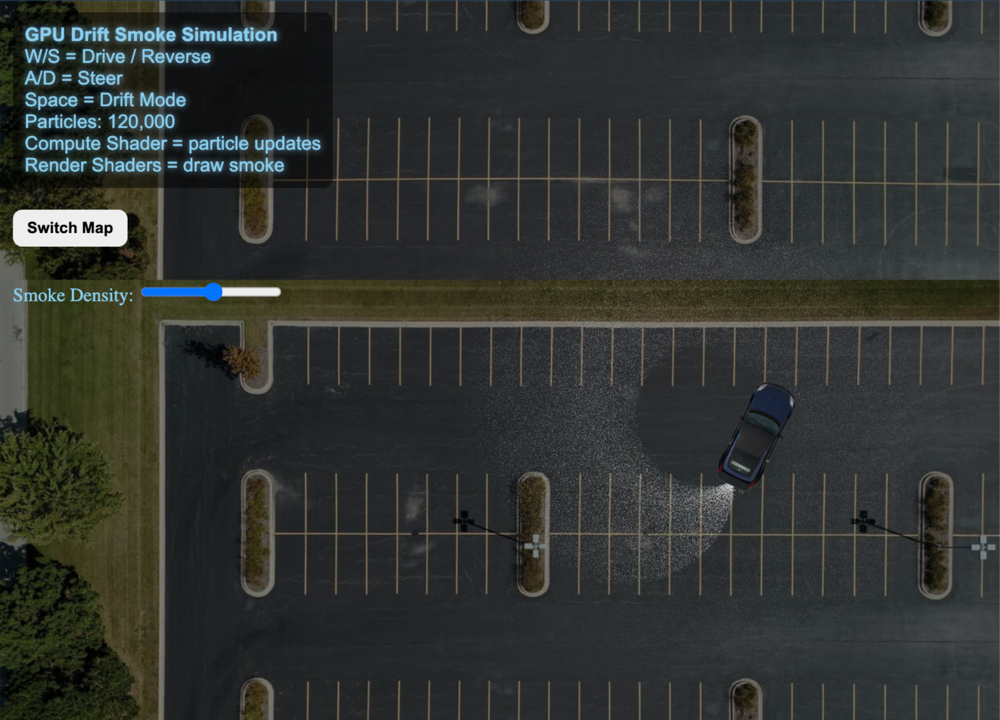

# <h1 align="center">WebGPU Drift Smoke Simulator</h1>

<p align="center">
  
</p>

<p align="center">
Real-time WebGPU drift smoke simulator using WGSL compute and render shaders.
</p>

Real-time WebGPU drift smoke simulator using WGSL compute and render shaders.

## Project Overview

This project is an interactive drift smoke particle simulator inspired by JDM drifting culture and racing games. The simulation uses WebGPU to render thousands of particles in real time while simulating drifting movement, smoke spread, and directional particle behavior.

The project focuses on GPU-based particle simulation using WGSL shaders and combines compute, vertex, and fragment shader stages to create dynamic smoke effects behind a drifting car.

## Features

- Real-time smoke particle simulation
- WebGPU rendering pipeline
- WGSL compute shaders
- Interactive drifting controls
- Car movement and rotation physics
- Dynamic smoke direction based on drift angle
- Multiple map/background support
- GPU-based particle updates
- Adjustable smoke behavior

## Technologies Used

- WebGPU
- WGSL (WebGPU Shading Language)
- JavaScript
- HTML/CSS

## Controls

| Key | Action |
|---|---|
| W | Accelerate |
| S | Reverse / Brake |
| A | Turn Left |
| D | Turn Right |
| Space | Drift |

## How It Works

The CPU side updates car position, angle, and movement data each frame. These values are passed into GPU uniform buffers which control the smoke emitter position and particle movement.

The compute shader updates:
- particle velocity
- position
- lifetime
- smoke spread

The render pipeline then draws the particles onto the screen every frame.

## Challenges

One of the biggest challenges during development was correctly aligning the smoke emitter with the rear of the car while rotating and drifting. Initially, particles appeared in incorrect directions because the image rotation and movement math were not synchronized. This was fixed by matching the car rotation transform with the emitter offset calculations.

## Running the Project

Because WebGPU requires HTTPS or localhost, run the project using a local server.

Example using Python:

```bash
python3 -m http.server 8000

Then open:    http://localhost:8000
